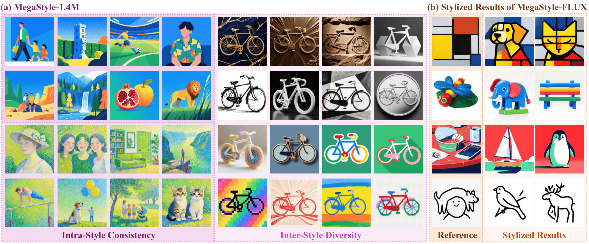
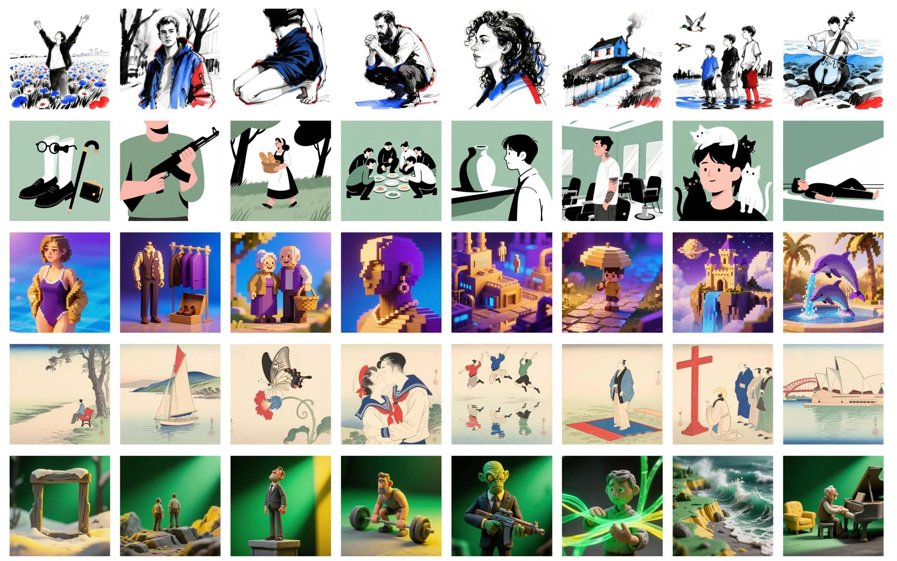

# MegaStyle: Constructing Diverse and Scalable Style Dataset via Consistent Text-to-Image Style Mapping

<a href='https://arxiv.org/abs/2604.08364'></a> 
<a href='https://jeoyal.github.io/MegaStyle/'></a>
<a href='https://huggingface.co/Gaojunyao/MegaStyle'></a>
<a href='https://huggingface.co/datasets/tencent/MegaStyle-1.4M'></a>
<a href='https://modelscope.cn/models/junyaogao/MegaStyle'></a>
<a href='https://modelscope.cn/datasets/Tencent-Hunyuan/MegaStyle-1.4M'></a>

**MegaStyle** is a novel and scalable data curation pipeline that first explores consistent T2I style mapping ability from current large generative models to construct intra-style consistent, inter-style diverse and high-quality style dataset.

**Your star is our fuel!  We're revving up the engines with it!** Check out our [project page](https://jeoyal.github.io/MegaStyle/) for more visual results!



## News
- [2026/4/23] 🔥 We release a [Gradio demo](./gradio_demo.py) and [ComfyUI custom nodes](./comfyui/) (with a ready-to-use [workflow](./comfyui/workflow_megastyle.json)) for style transfer using MegaStyle-FLUX.
- [2026/4/22] 🔥 Thanks to [@olfronar](https://github.com/olfronar)'s contribution! The style score computation using MegaStyle-Encoder is now available on [HF space](https://huggingface.co/spaces/olfronar/megastyle-comparison).
- [2026/4/21] 🔥 We release the training/inference codes, [models](https://huggingface.co/Gaojunyao/MegaStyle) and [dataset](https://huggingface.co/datasets/tencent/MegaStyle-1.4M) of MegaStyle!!!

## TODO List
- [ ] A more diverse and larger-scale style dataset.

## MegaStyle-1.4M
[MegaStyle-1.4M](https://huggingface.co/datasets/tencent/MegaStyle-1.4M) is a large-scale style dataset built through a scalable pipeline that leverages consistent text-to-image style mapping of Qwen-Image. It combines 170K curated style prompts with 400K content prompts to generate 1.4M high-quality images that share strong intra-style consistency while covering diverse fine-grained styles.



## Get Started
Trained on MegaStyle1.4M, we introduce MegaStyle-FLUX and MegaStyle-Encoder for generalizable style transfer and reliable style similarity measurement.
### Clone the Repository

```
git clone git@github.com:Tencent/MegaStyle.git
cd ./MegaStyle
```

### Environment Setup
```
conda create -n megastyle python==3.10
conda activate megastyle
pip install diffsynth==1.1.8
```

### Downloading Checkpoints

1. Download the pretrained models of [SigLIP](https://huggingface.co/google/siglip-so400m-patch14-384) and [FLUX.1-dev](https://huggingface.co/black-forest-labs/FLUX.1-dev).

2. Download the [models](https://huggingface.co/Gaojunyao/MegaStyle) into `./models/`. 

### Running Inference
For image style transfer, we provide 50 reference style images from <a href='https://drive.google.com/file/d/1Q_jbI25NfqZvuwWv53slmovqyW_L4k2r/view?usp=drive_link'>StyleBench</a> in `./ref_styles`:
```
python inference.py --ckpt_path models/megastyle_flux.safetensors --ref_path ./ref_styles
```
For computing style score:
```
python style_score.py --ckpt_path models/megastyle_encoder.pth --real_image_path <path/to/image.png> --fake_image_path <path/to/image.png>
```

### Gradio Demo
An interactive web UI is provided via [`gradio_demo.py`](./gradio_demo.py).
Install Gradio and launch:
```
pip install gradio
python gradio_demo.py --ckpt_path models/megastyle_flux.safetensors --ref_path ./ref_styles
```
Then open http://localhost:8080 in your browser. Upload a reference style image,
type a content prompt, and click **Generate**. Common options:
```
python gradio_demo.py \
    --ckpt_path models/megastyle_flux.safetensors \
    --ref_path ./ref_styles \
    --server_name 0.0.0.0 --server_port 8080 [--share]
```

### ComfyUI Custom Nodes
Custom nodes live in `./comfyui/` and, together with the shipped
[`workflow_megastyle.json`](./comfyui/workflow_megastyle.json), make MegaStyle
available as a drop-in graph inside [ComfyUI](https://github.com/comfyanonymous/ComfyUI).
The exposed nodes mirror a standard Flux workflow:

- **Models Loader** — loads FLUX.1-dev into a `FluxImagePipeline`.
- **MegaStyle LoRA Loader** — patches the MegaStyle-FLUX LoRA onto the DiT.
- **Reference Style** — `LoadImage` input for the style reference.
- **Text Encode** — CLIP + T5 prompt encoding.
- **VAE Encode** — encodes the reference style image into latents.
- **Flow Matching Scheduler** — denoise loop with `enable_shift_rope=True`.
- **VAE Decode** — decodes latents back to an image.
- **Save Image** — writes results to `output/MegaStyle/`.

#### 1. Clone & install ComfyUI (skip if you already have one)
```
git clone https://github.com/comfyanonymous/ComfyUI.git
cd ComfyUI
conda activate megastyle            # reuse the MegaStyle env (needs diffsynth==1.1.8)
pip install -r requirements.txt
cd ..
```

#### 2. Register the MegaStyle node package
From the MegaStyle repo root (so that `flux_image_mega.py` stays importable):
```
# Option A (recommended): symlink the comfyui package directly.
ln -s "$(pwd)/comfyui" /path/to/ComfyUI/custom_nodes/MegaStyle

# Option B: symlink the whole repo, then drop a one-line shim.
ln -s "$(pwd)" /path/to/ComfyUI/custom_nodes/MegaStyle
echo 'from .comfyui import NODE_CLASS_MAPPINGS, NODE_DISPLAY_NAME_MAPPINGS' \
    > /path/to/ComfyUI/custom_nodes/MegaStyle/__init__.py
```

On first launch the package will also:
- copy `comfyui/workflow_megastyle.json` to `ComfyUI/user/default/workflows/MegaStyle.json`
  so it shows up in the **Workflows** side panel;
- symlink `ref_styles/*.jpg` into `ComfyUI/input/` so the default `LoadImage`
  node resolves `00.jpg` out of the box.

Disable with `MEGASTYLE_AUTO_INSTALL_WORKFLOW=0` / `MEGASTYLE_AUTO_INSTALL_REFS=0`.
If auto-discovery of the ComfyUI root fails, set `MEGASTYLE_COMFY_ROOT=/path/to/ComfyUI`.

#### 3. Launch & run
```
cd /path/to/ComfyUI
python main.py --listen 0.0.0.0 --port 8080
```
Open `http://localhost:8080`, pick the **MegaStyle** workflow from the
*Workflows* panel, then click **Queue Prompt**. The default `lora_path` is
`models/megastyle_flux.safetensors` (resolved relative to the MegaStyle
repo root); set it to an absolute path if you keep the checkpoint
elsewhere.
See [`./comfyui/README.md`](./comfyui/README.md) for the wiring diagram and
advanced options (CFG, custom negative prompts, etc.).

### Training
To train a style transfer model with paired supervision, please download our style dataset, [MegaStyle1.4M](https://huggingface.co/datasets/tencent/MegaStyle-1.4M), and start training with:
```
bash FLUX.1-dev.sh # FLUX.1-dev-npu.sh for npu
```

## License and Citation
All assets and code are under the [license](./LICENSE.txt) unless specified otherwise.

If this work is helpful for your research, please consider citing the following BibTeX entry.
```
@article{gao2026megastyle,
  title={MegaStyle: Constructing Diverse and Scalable Style Dataset via Consistent Text-to-Image Style Mapping},
  author={Gao, Junyao and Liu, Sibo and Li, Jiaxing and Sun, Yanan and Tu, Yuanpeng and Shen, Fei and Zhang, Weidong and Zhao, Cairong and Zhang, Jun},
  journal={arXiv preprint arXiv:2604.08364},
  year={2026}
}
```

## Acknowledgements
The code is built upon [DiffSynth-Studio](https://github.com/modelscope/DiffSynth-Studio).